# Load testing hub panel

If you have any questions, you can ask [@Nikita Filonov](https://t.me/sound_right)

## Project setup

```shell
yarn install
yarn start
```

## Home

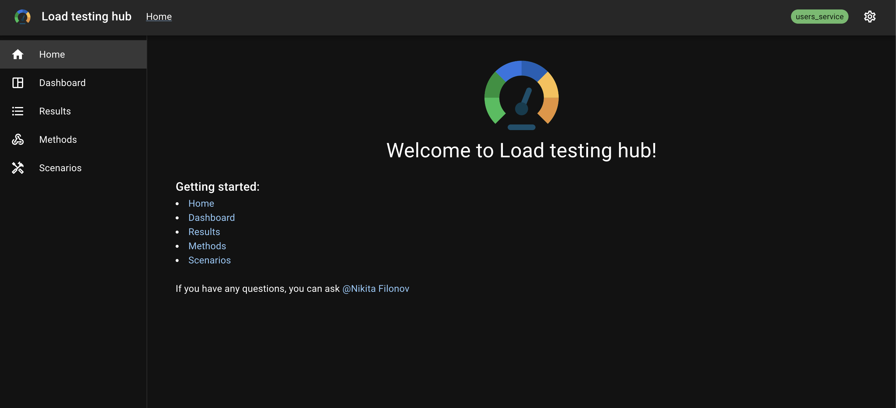

## Dashboard

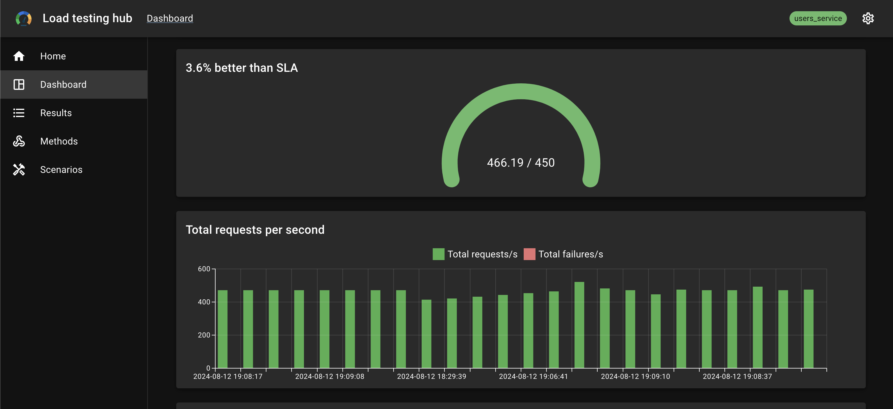
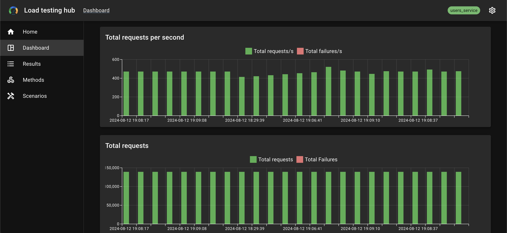
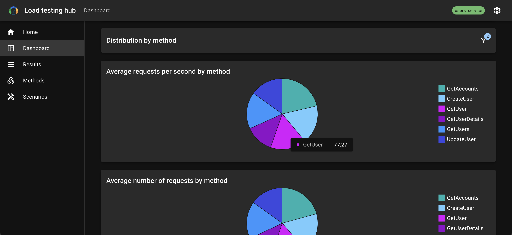
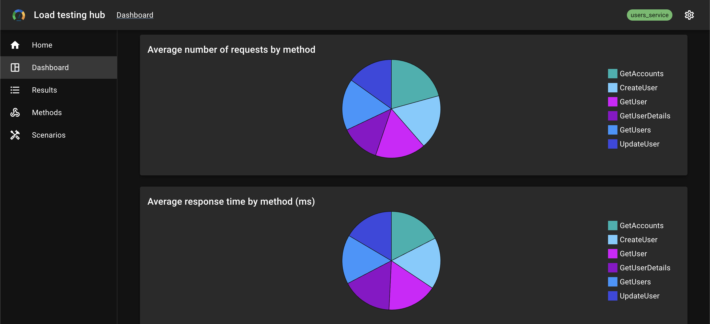

## Results

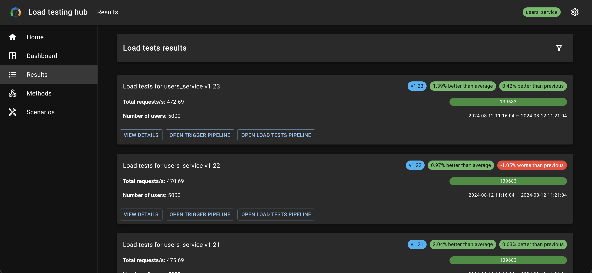
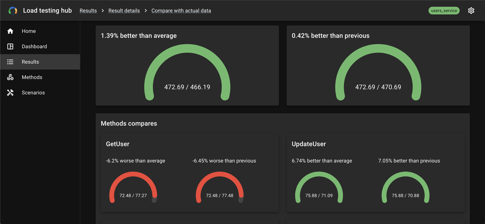
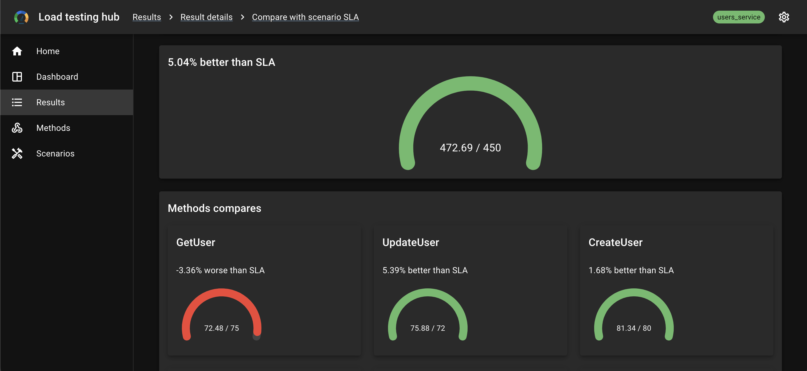
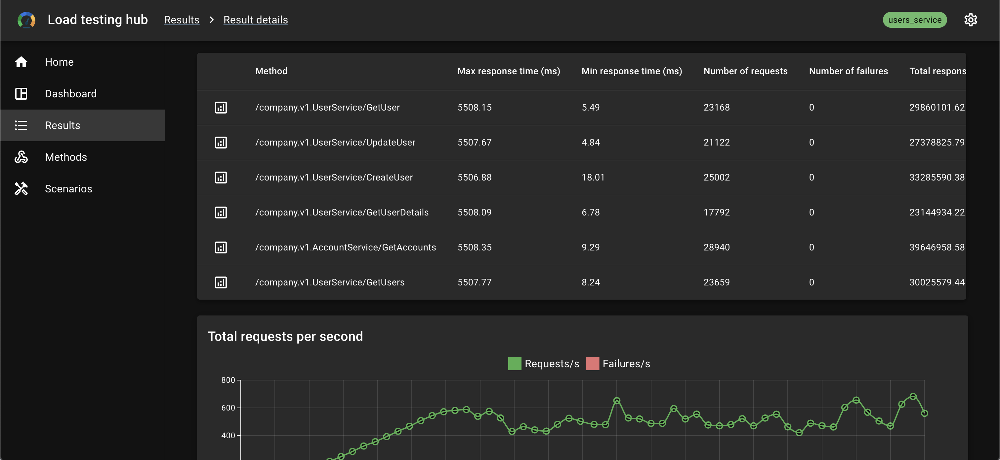
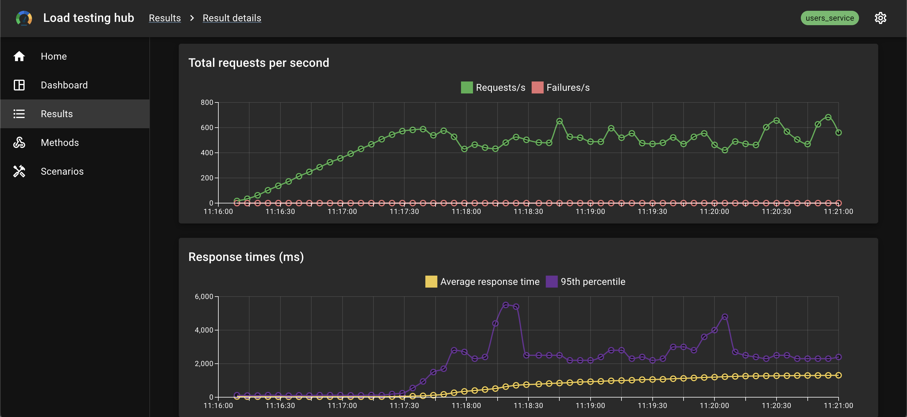
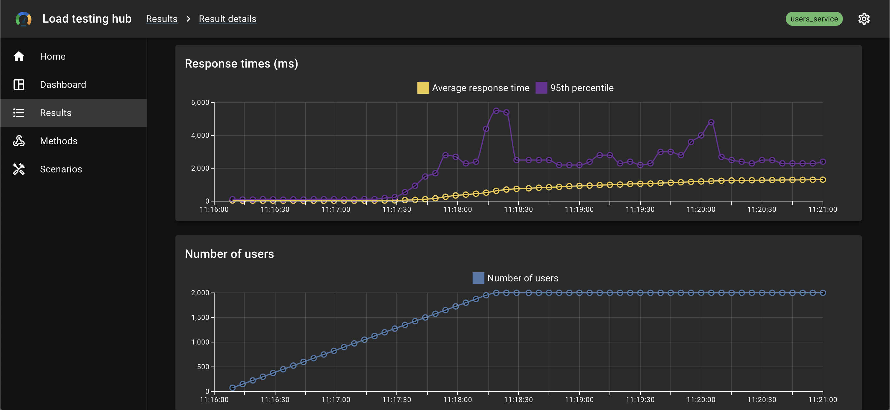
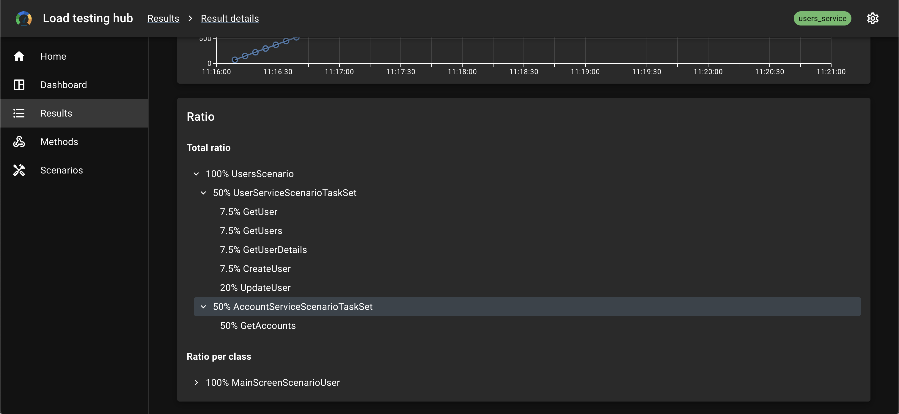

## Methods

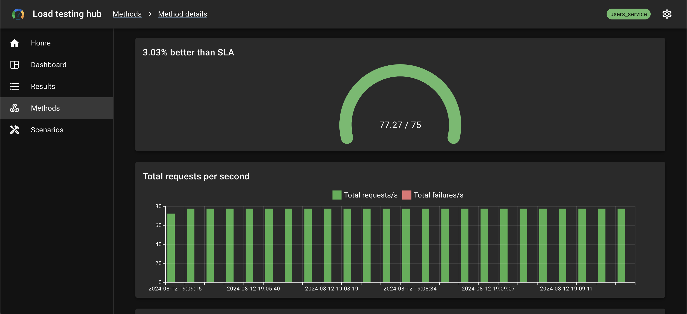

## Scenarios

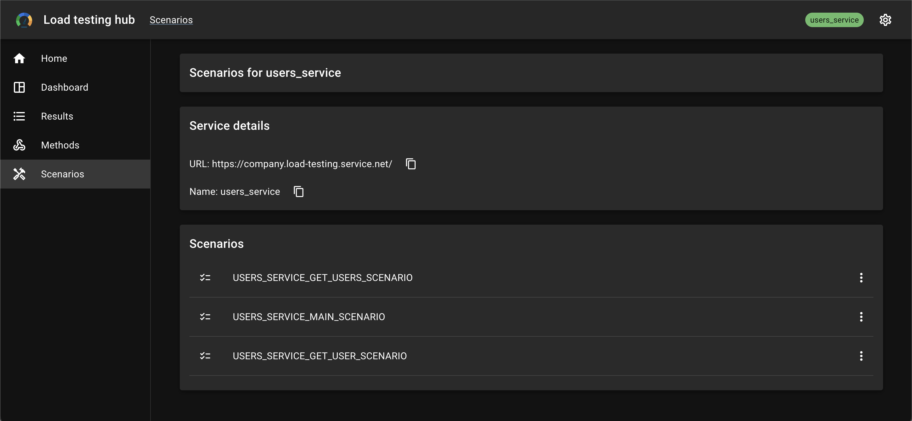