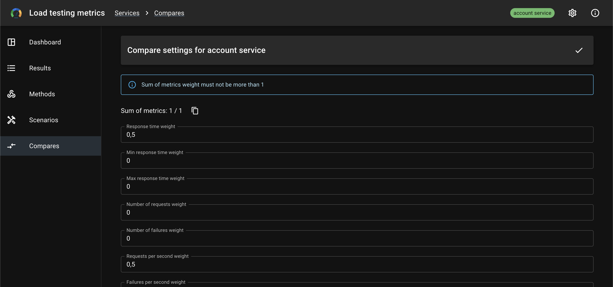
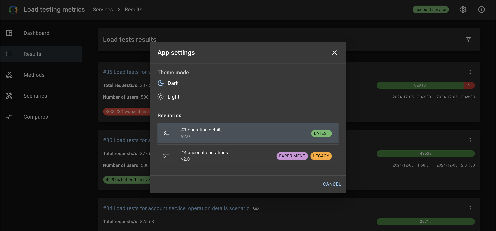

# Load testing hub panel

If you have any questions, you can ask [@Nikita Filonov](https://t.me/sound_right)

## Project setup

```shell
yarn install
yarn start
```

## Services

### Services list


### Create service


### Service details


## Dashboard

### Average numbers


### Charts


## Results

### Results list


### Details


### Comparison


## Methods

### Methods list


### Details


## Scenarios

### Scenarios list


### Create scenario


### Details


### Settings


## Compares

### Comparison settings



## Settings



## Welcome

