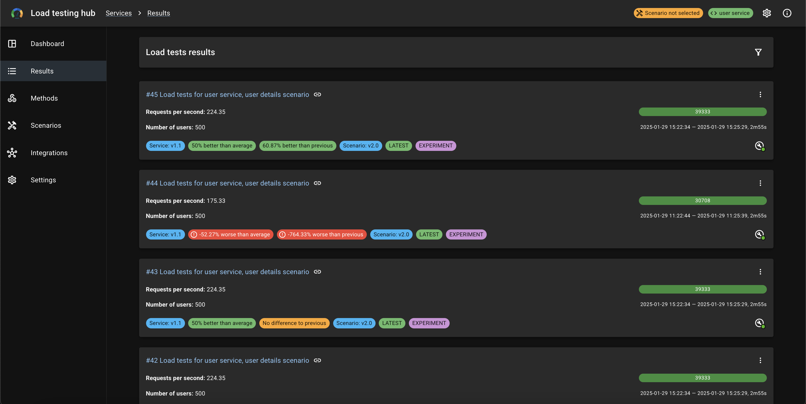

# Load testing hub panel

If you have any questions, you can ask [@Nikita Filonov](https://t.me/sound_right)

## Table of content

- [Project setup](#project-setup)
- [Services](#services)
    - [Services list](#services-list)
    - [Service details](#service-details)
- [Dashboard](#dashboard)
    - [Charts](#charts)
- [Results](#results)
    - [Results list](#results-list)
    - [Result details](#result-details)
- [Methods](#methods)
    - [Methods list](#methods-list)
    - [Method details](#method-details)
- [Scenarios](#scenarios)
    - [Scenarios list](#scenarios-list)
    - [Scenario details](#scenario-details)
- [Integrations](#integrations)
    - [Integrations list](#integrations-list)
    - [Integration details](#integration-details)
- [Settings](#settings)
    - [General settings](#general-settings)
    - [Compare weights settings](#compare-weights-settings)
    - [Compare highlight threshold settings](#compare-highlight-threshold-settings)
- [App info](#app-info)

## Project setup

```shell
yarn install
yarn start
```

## Services

### Services list


### Service details


## Dashboard

### Charts


## Results

### Results list



### Result details


## Methods

### Methods list


### Method details


## Scenarios

### Scenarios list


### Scenario details


## Integrations

### Integrations list


### Integration details


## Settings

### General settings


### Compare weights settings


### Compare highlight threshold settings


## App info

